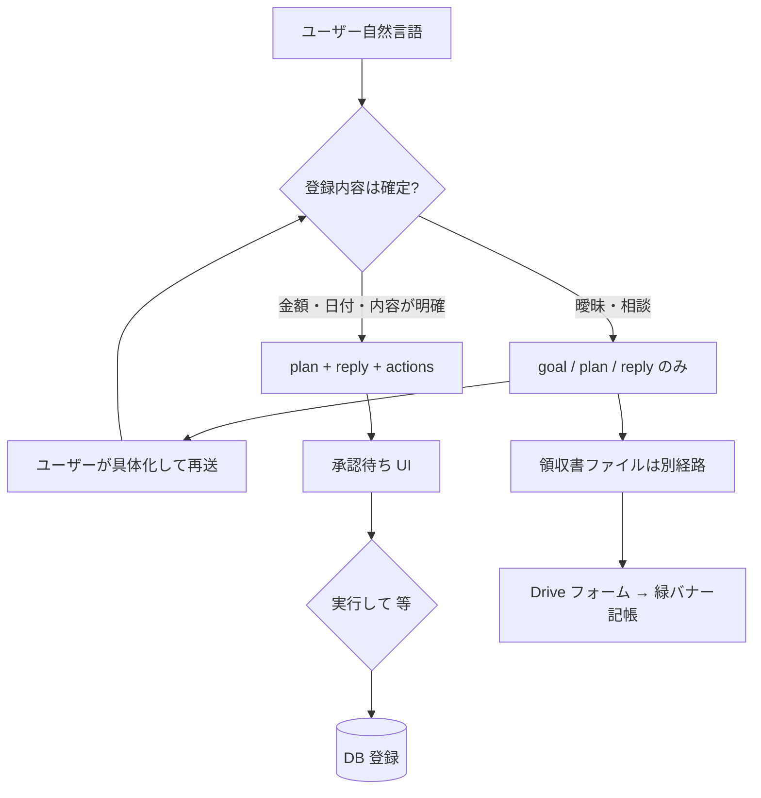

# Neo+ — Next.js 15 App Router 移行ガイド（完全版）

> **対象**: Vanilla JS PWA → Next.js 15 + Supabase SSR + TypeScript  
> **更新日**: 2026-04（Gemini→Soul ブリッジ・Agentic 確認フロー・Drive+Soul・チェックリスト追記）  
> **原則**: 簡単に使えるのに、裏側はハイエンドで安全

---

## 1. 推奨フォルダ構造（Feature-based / Domain-driven）

```
neo-plus/
│
├── app/                              # Next.js App Router ルート定義
│   ├── (auth)/                       # 認証グループ（サイドバーなし）
│   │   ├── login/
│   │   │   ├── page.tsx              # Server Component（searchParams 受け取り）
│   │   │   └── _components/
│   │   │       └── AuthForm.tsx      # Client Component（ログイン/サインアップ切替）
│   │   └── layout.tsx                # ミニマルレイアウト（ロゴのみ）
│   │
│   ├── (app)/                        # 認証済みグループ（サイドバーあり）
│   │   ├── layout.tsx                # Server Component（user 取得 → AppSidebar へ）
│   │   ├── settings/
│   │   │   └── page.tsx              # Server Component（Drive 連携など）
│   │   ├── cockpit/
│   │   │   ├── page.tsx              # Server Component（PPR + 並列 fetch）
│   │   │   └── _components/
│   │   │       ├── ActivityFeed.tsx  # Client（楽観的更新 + Realtime 受信）
│   │   │       ├── SummaryCards.tsx  # Server props 受け取り（純表示）
│   │   │       └── QuickEntryButton.tsx  # Client（モーダル開閉）
│   │   ├── chat/
│   │   │   ├── page.tsx              # Server Component（シェルのみ）
│   │   │   └── _components/
│   │   │       ├── ChatWindow.tsx    # Client（メッセージ状態 + Realtime cleanup）
│   │   │       ├── MessageBubble.tsx # Client（Neo左/ユーザー右 アニメーション）
│   │   │       └── ChatInput.tsx     # Client（Shift+Enter改行/Enter送信）
│   │   └── projects/
│   │       ├── page.tsx
│   │       └── [id]/page.tsx
│   │
│   ├── api/
│   │   ├── health/route.ts           # ヘルスチェック（Middleware の matcher から除外）
│   │   ├── auth/
│   │   │   ├── callback/route.ts     # Supabase OAuth コールバック
│   │   │   └── google/
│   │   │       ├── route.ts          # Google OAuth 開始（redirect to Google）
│   │   │       └── callback/route.ts # code → token 交換 → DB 保存
│   │   └── chat/route.ts             # ストリーミングチャット（将来 Vercel AI SDK）
│   │
│   ├── layout.tsx                    # Root Layout（html/body/font/global providers）
│   └── globals.css                   # Drive バナー用の軽い keyframes（reduced-motion 対応）
│
├── features/                         # ドメインロジック（UI に依存しない）
│   ├── activities/
│   │   ├── actions.ts                # Server Actions: insert/update/delete/fetch
│   │   └── soul-pipe.ts              # Soul メッセージ生成（純粋関数）
│   ├── drive/
│   │   ├── actions.ts                # uploadToDriveAndCreateActivity（Zero-Server 本流）
│   │   └── DriveUploadForm.tsx       # 参考: FormData → Server Action
│   ├── chat/
│   │   ├── actions.ts                # handleInstruction Server Action
│   │   └── soul-prompt.ts            # System prompt 構築（純粋関数）
│   ├── projects/
│   │   └── actions.ts
│   └── soul/
│       └── server.ts                 # Soul ローダー（DB → 5分キャッシュ → default）
│
├── lib/                              # インフラ層（ドメイン非依存）
│   ├── supabase/
│   │   ├── client.ts                 # Browser singleton（GoTrueClient 重複防止）
│   │   ├── server.ts                 # requireAuth / handleServerActionError を含む
│   │   └── types.ts                  # Database<> 型定義
│   ├── soul-pipeline.ts              # 統一 Soul ポストプロセッシング（8ステップ）
│   ├── gemini-soul-bridge.ts         # Gemini→Soul 強制ゲート（executeGeminiWithMandatorySoulPipeline）
│   ├── drive-upload-soul.ts          # finalizeDriveUploadMessage / finalizeDrivePrerequisiteMessage
│   ├── drive-user-access.ts          # OAuth トークン取得・refresh・Neo フォルダ ID
│   ├── drive-integration-status.ts   # Server: user_integrations から Drive 連携済みか
│   ├── agentic-types.ts              # ParsedAction / AgenticLoopPhase
│   ├── agentic-parser.ts             # <goal><plan><reply><actions> パース
│   ├── agentic-phase.ts              # resolveLoopPhaseForReply
│   ├── agent-chat-confirm.ts         # 「実行して」判定（サーバー/クライアント共通）
│   ├── validation.ts                 # Zod スキーマ（全 Server Action 入力）
│   ├── rate-limit.ts                 # レート制限（インメモリ / Upstash Redis）
│   └── google-drive.ts               # Google Drive OAuth + API ラッパー
│
├── components/                       # 共有 UI（2ルート以上で使う）
│   ├── AppSidebar.tsx                # ナビ（AppNavLinks を内包）
│   ├── AppNavLinks.tsx               # Client: usePathname で現在地ハイライト
│   ├── AppHeader.tsx                 # ロゴ → /cockpit
│   └── ui/                           # shadcn/ui などの汎用部品
│
├── hooks/                            # Client 専用カスタムフック
│   ├── useOptimisticActivities.ts    # useOptimistic を使った楽観的更新
│   └── useGoogleDriveSync.ts         # Drive 連携状態管理
│
├── soul/                             # Soul Container（TypeScript）
│   ├── config.ts                     # NeoSoul 型 + NEO_DEFAULT_SOUL 定数
│   ├── middleware.ts                  # applySoul パイプライン（7ステップ）
│   └── index.ts                      # 公開 API re-export
│
├── middleware.ts                     # Next.js Middleware（Edge Runtime）
├── next.config.ts                    # PPR / headers / images
└── tsconfig.json                     # strict: true / paths aliases
```

### 配置判断フローチャート

```
新しいコードを書く前に問う:

Q1: サーバーでのみ動くか？
  Yes → features/xxx/actions.ts（Server Action）または lib/xxx.ts（インフラ）
  No  →
    Q2: 2ルート以上で使うか？
      Yes → components/ または hooks/
      No  → app/xxx/_components/（コロケーション）

Q3: UI か、ロジックか？
  UI   → components/ または _components/
  Logic → features/xxx/（UI に依存しない）
  Both → 分離する（データ取得は Server, 状態管理は Client）
```

---

## 2. 主要ファイルのコード例

### 2-1. Supabase クライアント設定（セキュリティ詳解）

#### `lib/supabase/server.ts` — requireAuth の実装

```ts
/**
 * requireAuth の 4層セキュリティ:
 *
 * 層1: JWT 検証（Supabase Auth サーバーとの通信）
 *   supabase.auth.getUser() → Supabase が JWT を検証 → 改ざん検出
 *
 * 層2: Cookie 検証
 *   createServerClient が Cookie から JWT を正しく読む
 *   → ハイジャックトークンも getUser() で弾く
 *
 * 層3: Error スロー（詳細を隠す）
 *   throw new Error('UNAUTHORIZED')  ← スタックトレースを Client に漏らさない
 *
 * 層4: handleServerActionError でユーザー向け日本語メッセージに変換
 */
export const requireAuth = async (): Promise<User> => {
  const supabase = await createServerActionClient();
  const { data: { user }, error } = await supabase.auth.getUser();
  if (error || !user) {
    const err = new Error('UNAUTHORIZED') as Error & { statusCode: number };
    err.statusCode = 401;
    throw err;
  }
  return user;
};
```

#### `lib/supabase/client.ts` — ブラウザシングルトン

```ts
// ❌ NG: 毎レンダーで createBrowserClient → GoTrueClient が重複
function MyComponent() {
  const supabase = createBrowserClient(url, key);
}

// ✅ OK: モジュールスコープのシングルトン
let _client: SupabaseClient | null = null;
export const getSupabaseBrowserClient = () => {
  if (!_client) _client = createBrowserClient<Database>(url, key);
  return _client;
};
```

### 2-2. Zod バリデーション + レート制限 の 4層防御パターン

```ts
'use server';
export async function insertActivity(rawInput: unknown): Promise<ActionResult> {
  try {
    // 層1: JWT 検証
    const user = await requireAuth();

    // 層2: レート制限（1分60件）
    await checkRateLimit(`activity:insert:${user.id}`, RATE_LIMIT_PRESETS.activityInsert);

    // 層3: Zod バリデーション（型安全 + 日本語エラーメッセージ）
    const parsed = ActivityInsertSchema.safeParse(rawInput);
    if (!parsed.success) return { ok: false, error: formatZodError(parsed.error) };

    // 層4: DB 挿入（RLS + .eq('user_id', user.id) 二重保護）
    const { data, error } = await supabase
      .from('activities')
      .insert({ ...parsed.data, user_id: user.id })
      .select('id').single();

    if (error) return { ok: false, error: '保存に失敗しました' };

    // Soul パイプライン（必ず通す）
    const soul = await loadSoulServer(user.id);
    const soulResult = await runSoulPipeline({ raw: `「${parsed.data.title}」を記録しました。`, userId: user.id, soulOverride: soul });

    revalidatePath('/cockpit');
    return { ok: true, id: data.id, message: soulResult.text };
  } catch (err) {
    return handleServerActionError(err);  // UNAUTHORIZED / RATE_LIMITED を変換
  }
}
```

### 2-3. Soul 統合フロー（すべてのパスで必ず通す）

```
                    ┌─────────────────────────────────────┐
                    │      lib/soul-pipeline.ts           │
                    │   runSoulPipeline() — 8ステップ     │
                    │                                     │
                    │  1. 禁止フレーズ除去               │
                    │  2. 行動ルール適用                 │
                    │  3. カテゴリ税務ヒント             │
                    │  4. 励まし注入（確率 + 3分間隔）  │
                    │  5. 丁寧度チューニング             │
                    │  6. 長さ制御                       │
                    │  7. TAX_DISCLAIMER 付加            │
                    │  8. アラートプレフィックス         │
                    └────────────┬────────────────────────┘
                                 ↑
              ┌──────────────────┼──────────────────┐
              │                  │                  │
   insertActivity()    handleInstruction()    提案生成（将来）
   updateActivity()    （チャット応答）
   deleteActivity()
```

**重要**: `rawReply` を直接 Client に返さない。必ず `runSoulPipeline()` を通してから返す。

#### Gemini を使う Server Action では `executeGeminiWithMandatorySoulPipeline` を使う

| ファイル | 役割 |
|---------|------|
| `lib/gemini-soul-bridge.ts` | `executeGeminiWithMandatorySoulPipeline` — 成功時は `finalizeAssistantReplyAfterGemini`、失敗時は `runSoulPipelineForAiFailure` を**必ず**通す |
| `lib/drive-upload-soul.ts` | Drive アップロード後のユーザー向け文は `finalizeDriveUploadMessage` → `runSoulPipeline` |
| `features/drive/actions.ts` | `buildDriveUploadAssistantMessage` — 認証 + レート制限 + 上記 Soul |

コードレビューでは `GEMINI_SOUL_PIPELINE_ENFORCED_MARKER` を grep し、`generateContent` をブリッジ無しで呼んでいないか確認する。

#### Soul Pipeline 適用チェックリスト（新規 Server Action を追加するとき）

1. **認証**: 先頭で `requireAuth()`（または公開 API なら別設計を明記）。
2. **レート制限**: `checkRateLimit` にキー `domain:op:userId`。
3. **入力**: `lib/validation.ts` の Zod で `unknown` を受け、ユーザー向けは **`runSoulPipeline` で包む**か、`formatZodError` を Soul 用 raw に含める（チャットの `handleInstruction` は前者）。
4. **DB**: `createServerActionClient` + RLS + コード側 `.eq('user_id', user.id)`。
5. **ユーザー向けテキスト**: `runSoulPipeline` / `finalizeAssistantReplyAfterGemini` / `runSoulPipelineForAiFailure` のいずれかを**必ず**通す（技術エラー文をそのまま返さない）。
6. **Gemini / 外部 LLM**: `lib/gemini-soul-bridge.ts` の `executeGeminiWithMandatorySoulPipeline` を使う（例外はレビューで合意済みのみ）。
7. **エラー返却**: `handleServerActionError(err)` で Client に渡す（スタックを漏らさない）。
8. **Agentic ツール化**: DB 副作用は **`handleInstruction` の承認フロー**または同等の明示的 OK 後のみ。詳細は **§8**。

#### `deleteActivity` の API（破壊的変更）

- **推奨**: `deleteActivity({ id: string })` — Zod で検証。
- **互換**: `deleteActivityById(id: string)` — 内部で `deleteActivity({ id })` を呼ぶ（非推奨・移行用）。

#### Agentic（軽量）確認フロー

- Gemini の応答に `<goal>` / `<plan>`（任意）と `<reply>` / `<actions>` を含められる（`features/chat/soul-prompt.ts`、`lib/agentic-parser.ts`）。
- `<actions>` は既定で承認待ち。ユーザーが「実行して」等と送り、`pendingActionsToConfirm` に**前ターンのアクション**と **HMAC 用 `pendingApprovalToken` / `Nonce` / `IssuedAt`** を同梱すると、`insertActivity` が実行される（INSERT のみ本実装。§8-2.0b）。
- クライアントは `ChatWindow` が `pendingActions` と **目標（goal）/ 計画（plan）** を保持し、確認バナー + `実行して登録する` ボタンを表示。
- **詳細は §8 Agentic Loop 実装ガイド**。

### 2-4. Realtime + Server Components の正しい組み合わせ

```tsx
// ChatWindow.tsx (Client Component)

useEffect(() => {
  const channel = supabase
    .channel(`activities:${userId}`)
    .on('postgres_changes', {
      event:  '*',
      schema: 'public',
      table:  'activities',
      filter: `user_id=eq.${userId}`,  // ← ユーザー固有フィルタ（必須）
    }, () => {
      // Server Component のキャッシュを無効化して再フェッチ
      router.refresh();
    })
    .subscribe();

  // ⚠️ cleanup 必須
  return () => { supabase.removeChannel(channel); };
}, [userId, supabase, router]);
```

**revalidateTag との使い分け**:

| 方法 | タイミング | 適切な場面 |
|------|-----------|-----------|
| `router.refresh()` | Realtime イベント受信時（Client） | チャットで収支が更新された場合 |
| `revalidatePath('/cockpit')` | Server Action 完了後 | ユーザーが直接フォームで登録した場合 |
| `revalidateTag('activities')` | 外部 API 更新後（Route Handler） | Webhook 受信時（将来） |

### 2-5. Google Drive 統合フロー（Zero-Server / Soul 必須）

**ゴール**: ファイルの実体は **ユーザーの Google Drive（Neo 専用フォルダ）** に置き、Neo+ の Supabase には **ポインタと OAuth トークンだけ** を載せる。ユーザー向け文言は **必ず `finalizeDriveUploadMessage` / `finalizeDrivePrerequisiteMessage`**（内部で `runSoulPipeline`）。

#### 完全フロー（本番想定）

1. **初回 OAuth**  
   `/api/auth/google` → `getGoogleOAuthUrl` → コールバックで `exchangeCodeForTokens` → **`user_integrations`** に `access_token` / `refresh_token` / `expiry_date` / `scope` を保存（**本番ではトークン暗号化 or Vault を推奨**）。
2. **Neo フォルダ**  
   初回アップロード時に `ensureNeoFolderExists` → **`folder_id`** を `user_integrations` に保存。
3. **アップロード**  
   Client が `FormData` で `file`（+ 任意 `kind`）を渡し、Server Action **`uploadToDriveAndCreateActivity`** が実行される。
4. **認可**  
   `requireAuth` → `checkRateLimit`（`RATE_LIMIT_PRESETS.driveFileUpload`）→ Zod（種別・サイズ・MIME）。
5. **トークン**  
   `lib/drive-user-access.ts` の `getValidGoogleDriveAccessForUser` → 期限が近ければ `refreshAccessToken` → DB 更新。
6. **Drive へ保存**  
   `uploadFileToDrive`（`lib/google-drive.ts`）— **バイナリは Supabase に保存しない**。
7. **ポインタ**  
   成功したら **`drive_file_pointers`** に `drive_file_id` / `web_view_link` / 元ファイル名 / MIME / `kind` のみ INSERT（RLS で `user_id` 自分のみ）。
8. **Neo の返答**  
   成否どちらも **`finalizeDriveUploadMessage`** または **`finalizeDrivePrerequisiteMessage`**（未連携・トークン失効・フォルダ失敗）で Soul 適用済みメッセージを返す。
9. **経費登録の確認**  
   メッセージで「記帳するか」を促し、**実際の金額・科目の登録はチャットや別フォーム**でユーザーが確定（プライバシーと同意のタイミングを分離）。

#### Server Action 一覧（`features/drive/actions.ts`）

| 関数 | 役割 |
|------|------|
| `uploadToDriveAndCreateActivity(formData)` | メイン。**アップロード + ポインタ + Soul** |
| `buildDriveUploadAssistantMessage({ fileName, upload })` | 既に Drive へ上げた結果だけ Soul したいとき |

#### 参考 UI

- `features/drive/DriveUploadForm.tsx` — `<form>` + `uploadToDriveAndCreateActivity` の最小例。

### 2-6. Zero-Server 設計ルール（プライバシー）

| ルール | 内容 |
|--------|------|
| **実体は Drive** | 画像/PDF のバイト列をアプリ DB に置かない。 |
| **ポインタのみ** | `drive_file_pointers` は `drive_file_id` と表示用メタデータに限定。 |
| **トークン** | `user_integrations` は行単位で RLS。本番は暗号化・キーローテーションを検討。 |
| **Soul 必須** | エラー・成功・未連携の**すべて**で `runSoulPipeline` 系を通す（技術文の直返し禁止）。 |
| **確認の分離** | アップロード成功 ≠ 経費確定。ユーザーがチャット等で「登録する」と言うまで勘定に乗せない。 |
| **レート制限** | `driveFileUpload` / `driveSoulMessage` で乱用を抑止。 |

**マイグレーション**: `supabase/migrations/20260405140000_neo_drive_zero_server.sql`（`user_integrations` + `drive_file_pointers` + RLS）。

---

## 3. Silent Breaking Changes トップ10と回避策

Next.js のメジャーバージョンアップで**エラーが出ず気づきにくい**変更をまとめた。
これを見落とすと「本番だけ動かない」という最悪のシナリオになる。

---

### 🔴 SBC-01: `cookies()` / `headers()` / `params` / `searchParams` が Promise 化

**バージョン**: Next.js 15

**症状**: 開発中は動くが、本番（React Strict Mode）でランダムに `undefined` が返る。
型エラーは出ない（ `Promise<T>` が `T` にも見えるため）。

```ts
// ❌ NG（Next.js 14 の書き方 — 型エラーなし、でも壊れる）
export default function Page({ params }: { params: { id: string } }) {
  const id = params.id;  // Promise を同期アクセスしている
}

// ✅ OK（Next.js 15）
export default async function Page({ params }: { params: Promise<{ id: string }> }) {
  const { id } = await params;
}

// ✅ OK（searchParams も同様）
export default async function Page({ searchParams }: { searchParams: Promise<{ q?: string }> }) {
  const { q } = await searchParams;
}
```

**チェック**: `grep -r "params\." app/ --include="*.tsx" | grep -v "await"` で同期アクセスを検出

---

### 🔴 SBC-02: Middleware で `getSession()` を使うと JWTが未検証

**バージョン**: Supabase SSR 全バージョン（Middleware の制約）

**症状**: Cookie を改ざんしても認証済みとして扱われる（セキュリティホール）。

```ts
// ❌ NG — JWT を検証しない
const { data: { session } } = await supabase.auth.getSession();
if (!session) redirect('/login');

// ✅ OK — Supabase サーバーで JWT を検証
const { data: { user } } = await supabase.auth.getUser();
if (!user) redirect('/login');
```

**影響**: 攻撃者が期限切れトークンで認証をバイパスできる。

---

### 🔴 SBC-03: Server Component で Cookie を書き込もうとする

**バージョン**: Next.js 13+（App Router 全般）

**症状**: ビルド時はエラーなし。実行時に `cookies().set is not available in Server Components` エラー（または無言で失敗）。

```ts
// ❌ NG — Server Component の supabase クライアントで setAll を実装
setAll: (cookiesToSet) => {
  cookiesToSet.forEach(({ name, value, options }) =>
    cookieStore.set(name, value, options)  // ← Server Component では不可
  );
},

// ✅ OK — setAll を no-op にする（トークン refresh は Middleware が担当）
setAll: () => {},
```

---

### 🔴 SBC-04: Server Action から Client に返す値に非 JSON 型が混入

**バージョン**: Next.js 13.4+（Server Actions）

**症状**: `Date` オブジェクトを返すと `Invalid Date` になる。`undefined` は `null` になる。関数はシリアライズエラー。

```ts
// ❌ NG
return { ok: true, createdAt: new Date(), data: undefined, cb: () => {} };

// ✅ OK — すべて JSON 互換型に変換
return { ok: true, createdAt: new Date().toISOString() };
// undefined は省略する（JSON.stringify が除外するため null と異なる）
```

---

### 🔴 SBC-05: Realtime subscription の cleanup 忘れ

**バージョン**: @supabase/supabase-js 全バージョン

**症状**: コンポーネント unmount 後も WebSocket イベントが飛び続け、`setState` が呼ばれ `Warning: Can't perform a React state update on an unmounted component` が出る（ただし React 18 以降はこの警告が削除され**無音**で起きる）。

```tsx
// ❌ NG — cleanup なし
useEffect(() => {
  const channel = supabase.channel('xxx').on('postgres_changes', ...).subscribe();
  // cleanup がない!
}, []);

// ✅ OK
useEffect(() => {
  const channel = supabase.channel('xxx').on('postgres_changes', ...).subscribe();
  return () => { supabase.removeChannel(channel); };  // ← 必須
}, [userId]);
```

---

### 🔴 SBC-06: `revalidatePath` を Client Component から呼ぶ

**バージョン**: Next.js 13.4+

**症状**: ビルドは通る。実行時に `Error: revalidatePath was called outside a request scope`。

```ts
// ❌ NG — Client Component 内から直接呼ぶ
import { revalidatePath } from 'next/cache';
function MyButton() {
  const handleClick = () => revalidatePath('/cockpit');  // ← エラー
}

// ✅ OK — Server Action を経由する
// server-action.ts: 'use server'; revalidatePath('/cockpit');
// client.tsx: <button onClick={() => serverAction()}>
```

---

### 🟡 SBC-07: `use server` を関数スコープに書いた場合の挙動

**バージョン**: Next.js 13.4+

**症状**: 関数内の `'use server'` は「インライン Server Action」として動作するが、ファイルトップとは異なる制約がある。特に**クロージャでキャプチャした変数が Client から送信**され、機密データが漏れる。

```ts
// ⚠️ 注意 — クロージャ変数がシリアライズされて Client に送られる
function ParentComponent({ secretKey }: { secretKey: string }) {
  async function dangerousAction() {
    'use server';
    // secretKey がシリアライズされて Client Bundle に含まれる可能性
    console.log(secretKey);
  }
  return <button formAction={dangerousAction}>送信</button>;
}

// ✅ 安全 — 機密情報は Server Action ファイル内の環境変数から取得する
// actions.ts: 'use server'; const key = process.env.SECRET_KEY;
```

---

### 🟡 SBC-08: PPR で Suspense 境界の位置が間違っている

**バージョン**: Next.js 14+（PPR 有効時）

**症状**: PPR が有効なのに全ページが動的レンダリングになる（Suspense がない or 位置が間違い）。

```tsx
// ❌ NG — Suspense が page.tsx の外にある
export default function Layout({ children }) {
  return (
    <Suspense fallback={<Loading />}>
      {children}  {/* ← Suspense が children を包むのは正しいが、
                       各ページが individually の dynamic content を持てない */}
    </Suspense>
  );
}

// ✅ OK — 動的コンテンツの直上に Suspense を置く
export default function CockpitPage() {
  return (
    <div>
      <StaticHeader />  {/* ← 静的シェル（即時表示） */}
      <Suspense fallback={<ActivitySkeleton />}>
        <DynamicActivityFeed />  {/* ← 動的コンテンツ（データ待ち） */}
      </Suspense>
    </div>
  );
}
```

---

### 🟡 SBC-09: Zod の `transform` 後の型が推論されない

**バージョン**: Zod 3.x

**症状**: `z.infer<typeof Schema>` で変換後の型（ISO 文字列）ではなく、変換前の型が推論される。

```ts
// ⚠️ 注意: infer は変換後の型を返す
const DateString = z.string().transform((val) => val.replace(/\//g, '-'));
type T = z.infer<typeof DateString>;  // string（変換後）

// 変換前後で型が分かれる場合は z.input / z.output を使う
type Input  = z.input<typeof ActivityInsertSchema>;   // 変換前
type Output = z.output<typeof ActivityInsertSchema>;  // 変換後（= z.infer）
```

---

### 🟡 SBC-10: Google Drive refresh_token が null になる

**バージョン**: Google OAuth 2.0（全期間）

**症状**: 初回連携後に tokens.refresh_token が存在するが、再連携後は null になる。
Access Token が1時間で切れると以降の API 呼び出しが全て失敗する。

```ts
// ❌ NG — access_type=offline なし / prompt=consent なし
const params = new URLSearchParams({
  response_type: 'code',
  scope: '...',
  // これだけでは refresh_token が取得できない
});

// ✅ OK — 両方必須
const params = new URLSearchParams({
  response_type: 'code',
  scope:         '...',
  access_type:   'offline',   // refresh_token を要求
  prompt:        'consent',   // 毎回同意画面（refresh_token 再発行のため）
});
```

**防止策**: `exchangeCodeForTokens()` の返値で `refresh_token === null` を監視し、Sentry 等でアラートを出す。

---

## 4. 環境変数チェックリスト

```env
# .env.local（Git にコミット禁止 — .gitignore に追加必須）

# ─ Supabase（公開可能）─────────────────────────────
NEXT_PUBLIC_SUPABASE_URL=https://xxxx.supabase.co
NEXT_PUBLIC_SUPABASE_ANON_KEY=eyJhb...

# ─ Gemini（サーバー専用 — NEXT_PUBLIC_ 厳禁）──────
GEMINI_API_KEY=AIza...

# ─ Google Drive OAuth（全てサーバー専用）─────────
GOOGLE_CLIENT_ID=xxxx.apps.googleusercontent.com
GOOGLE_CLIENT_SECRET=GOCSPX-...    # ← NEXT_PUBLIC_ 厳禁
GOOGLE_REDIRECT_URI=https://your-domain.com/api/auth/google/callback

# ─ Rate Limiting（本番のみ）────────────────────────
UPSTASH_REDIS_REST_URL=https://xxxx.upstash.io
UPSTASH_REDIS_REST_TOKEN=AXxx...

# ─ アプリ設定────────────────────────────────────────
NEXT_PUBLIC_APP_URL=http://localhost:3000
```

**ビルド前チェックコマンド**:
```bash
# NEXT_PUBLIC_ に機密情報が混入していないか確認
grep -r "NEXT_PUBLIC_" .env.local | grep -E "SECRET|KEY|TOKEN|PASSWORD"
```

---

## 5. 「これで安全に移行できる」最終チェックリスト

### ✅ セキュリティチェック

- [ ] すべての書き込み Server Action が `requireAuth()` を先頭で呼んでいる
- [ ] すべての Server Action に `checkRateLimit()` が設定されている
- [ ] すべての Server Action 入力が Zod でバリデートされている
- [ ] DB クエリに `.eq('user_id', user.id)` がある（RLS + コードの二重保護）
- [ ] `GEMINI_API_KEY` `GOOGLE_CLIENT_SECRET` に `NEXT_PUBLIC_` プレフィックスがない
- [ ] Middleware が `getUser()` を使っている（`getSession()` ではない）
- [ ] Server Components の `setAll` が no-op になっている
- [ ] `handleServerActionError()` でエラー詳細を Client に漏らしていない

### ✅ Soul Container チェック

- [ ] すべての Server Action の返答テキストが `runSoulPipeline()` を通している
- [ ] `loadSoulServer()` がキャッシュ（5分 TTL）を使っている（毎回 DB を叩かない）
- [ ] 励ましメッセージは確率制御（`encouragement × 0.3`）と 3分インターバルで制限
- [ ] 税務免責（`TAX_DISCLAIMER`）は `precision > 0.8` && 税務キーワードあり の場合のみ
- [ ] `Soul.behavior_rules` が `priority` 順に適用されている
- [ ] `chat/actions.ts` のパースエラー時も Soul がフォールバックテキストを返す

### ✅ Realtime チェック

- [ ] Realtime channel に `filter: user_id=eq.${userId}` が設定されている
- [ ] `useEffect` の cleanup で `supabase.removeChannel(channel)` を呼んでいる
- [ ] `router.refresh()` と `revalidatePath()` の使い分けが正しい
- [ ] Realtime subscription は認証済みの `userId` を基に作成している（匿名は不可）

### ✅ Next.js 15 対応チェック

- [ ] `cookies()` `headers()` `params` `searchParams` を `await` している
- [ ] Server Actions から返す値が JSON シリアライズ可能（`Date` → ISO文字列）
- [ ] PPR を使うページで `export const experimental_ppr = true` を設定している
- [ ] PPR の境界を Suspense で正しく区切っている
- [ ] `'use server'` をファイル先頭に書いている（関数スコープの罠に注意）

### ✅ Google Drive チェック

- [ ] OAuth URL に `access_type=offline` と `prompt=consent` がある
- [ ] `refresh_token` が null の場合のアラートを設定している
- [ ] `isTokenExpiringSoon()` で期限5分前から更新している
- [ ] `user_integrations` テーブルに RLS が設定されている
- [ ] スコープが `drive.file`（最小権限）になっている

### ✅ 型安全チェック

- [ ] `tsconfig.json` で `"strict": true` が設定されている
- [ ] Supabase 型を `Database` インターフェースから `z.infer<>` なしで手書きしていない
- [ ] `any` が使われていない（`grep -r ": any" src/` でゼロ件）
- [ ] Zod スキーマと `z.infer<>` が一致している（手書き型定義がない）

### ✅ パフォーマンスチェック

- [ ] `cockpit/page.tsx` で `Promise.all()` で並列 fetch している（ウォーターフォールなし）
- [ ] Soul の DB ロードが 5分キャッシュを活用している
- [ ] Rate Limit は本番で Upstash Redis を使用している（インメモリは開発のみ）
- [ ] `fetchActivities` の `limit` が 100 件を超えていない

---

## 6. 移行ロードマップ（推奨 6週間）

| 週 | 作業 | 完了基準 |
|----|------|--------|
| 1 | インフラ整備（next.config / lib/supabase / middleware） | Middleware が認証ルーティングを正しく処理 |
| 2 | 認証フロー（login page / AuthForm / OAuth callback） | ログイン→cockpit リダイレクト E2E テスト通過 |
| 3 | コアドメイン（activities Server Actions + Soul pipeline） | insert/update/delete + Soul メッセージ表示確認 |
| 4 | チャット（handleInstruction + ChatWindow Realtime） | Realtime で cockpit が自動更新される確認 |
| 5 | プロジェクト管理 + Google Drive 連携（初期） | OAuth フロー完了 + ファイル保存確認 |
| 6 | 本番リリース準備（RLS 全件レビュー / Lighthouse / Sentry） | Lighthouse Score ≥ 90 / セキュリティレビュー完了 |

---

## 7. Google Drive OAuth 連携フロー（Zero-Server 完成形）

### 7-1. エンドポイント

| パス | 役割 |
|------|------|
| `GET /api/auth/google` | OAuth 開始。`state` を `neo_google_oauth_state`（httpOnly Cookie）に保存し、Google へリダイレクト。**ログイン必須**（Middleware）。 |
| `GET /api/auth/google/callback` | `code` を `google-auth-library` の `OAuth2Client.getToken` で交換 → `user_integrations` に upsert → `ensureNeoFolderExists` → `folder_id` 保存 → `NEO_OAUTH_SUCCESS_PATH`（既定 `/cockpit`）へリダイレクト。 |

環境変数: `GOOGLE_CLIENT_ID`, `GOOGLE_CLIENT_SECRET`, `GOOGLE_REDIRECT_URI`（Google Cloud Console の「承認済みリダイレクト URI」と**完全一致**）。任意: `NEO_OAUTH_SUCCESS_PATH=/cockpit`。

### 7-2. トークンリフレッシュのライフサイクル

- **保存**: コールバックで `access_token` / `refresh_token` / `expiry_date` を `user_integrations` に保存する。
- **本番の必須運用（Zero-Server）**:
  - **トークンは平文のまま DB に置かない**。Supabase の **pgsodium / Vault**、またはアプリ層での **AES-GCM などの暗号化**で `access_token` / `refresh_token` を保護する（漏洩時の影響を最小化）。
  - **定期的なリフレッシュ**: 実際の更新はアップロード直前の **`getValidGoogleDriveAccessForUser`** が担当。長期間アプリを使わないユーザーでも期限切れに近いときは `isTokenExpiringSoon` → `refreshAccessToken` → DB 書き戻し。**バッチで全ユーザーを先回り更新する**運用は任意（コストとレート制限のトレードオフ）。
- **利用**: `lib/drive-user-access.ts` の **`getValidGoogleDriveAccessForUser`** が、アップロード前にトークンを読み、`isTokenExpiringSoon(expiry_date)` なら **`refreshAccessToken`**（`lib/google-drive.ts`）で更新し、DB に書き戻す。手動テストの観点は同ファイル先頭コメント参照。
- **Neo フォルダ**: `folder_id` が未設定のときだけ `ensureNeoFolderExists` を呼び、ID を DB に保存する。

### 7-3. 孤立ファイル対策（DB 保存失敗時）

- Drive へのアップロード成功後に `drive_file_pointers` への INSERT が失敗した場合、`lib/google-drive.ts` の **`deleteDriveFile`** で Drive 上のファイルをベストエフォート削除する（`features/drive/actions.ts`）。
- 完全な整合性が必要な場合は、将来 **トランザクション的アウトボックス** や **バックグラウンド掃除ジョブ** の併用を検討。

### 7-4. Zero-Server 運用ルール（再掲）

- **バイナリは Supabase に置かない**。ファイル実体のマスターは **ユーザーの Google Drive**。
- Supabase には **`drive_file_pointers`**（ID・リンク・メタ）と **`user_integrations`**（トークン）のみ。**トークン列は暗号化推奨**（§7-2）。
- **記帳**は Drive 保存と分離: `uploadToDriveAndCreateActivity` は **`pendingDriveConfirmation`** を返し、ユーザーがチャットの **「記帳する」** で `insertActivity`（`receipt_url` に `webViewLink` を載せる）。
- **OAuth 成功後の UX**: コールバックは `NEO_OAUTH_SUCCESS_PATH`（既定 `/cockpit`）へ **`?drive=connected`** 付きでリダイレクト。`DriveConnectionBanner` がクエリを読み、**約 3.8 秒表示**（`app/globals.css` の **フェードイン**）のあと **`router.replace` でクエリを除去**。初回は **`router.refresh()`** で `driveLinked` を同期。クエリ除去直後に `driveLinked` がまだ届かない短い間は **「連携を反映しています…」** を出し、届いたら **「Drive連携済み」** に切り替え（ちらつき防止）。
- **「あとで」**: チャットの保留バナー **`dismissDrivePendingMessage`** — 記帳だけキャンセルし、**Drive 上のファイルは削除しない**。Neo らしい一文を Soul Pipeline 経由でチャットに追加。

### 7-5. Soul Pipeline の強制適用（Drive 系）

| 処理 | 必ず通す関数 |
|------|----------------|
| アップロード成功/失敗のユーザー向け文 | `finalizeDriveUploadMessage`（内部で **`runSoulPipeline`**） |
| 未連携・refresh 失敗・フォルダ失敗 | `finalizeDrivePrerequisiteMessage`（**`runSoulPipeline`**） |
| バリデーション失敗など | **`runSoulPipeline`**（`features/drive/actions.ts`） |
| Gemini 連携 | `lib/gemini-soul-bridge.ts` の **`executeGeminiWithMandatorySoulPipeline`** |

**禁止**: 技術エラー文言をそのまま UI に出すこと。

### 7-6. 依存パッケージ

- `migration/package.json` に **`google-auth-library`** を追加済み。リポジトリルートで `npm install` するか、`migration` ディレクトリでインストールする。

### 7-7. 実装の置き方・ユーザー体験の例

**連携ボタンの置き方**

1. **コックピット**: `DriveConnectionBanner` をヘッダー直下に配置。未連携時のみ **「Google Driveを接続」** → `GET /api/auth/google`（Middleware 通過後、Google 同意画面）。連携済みは **「Drive連携済み」** のみ。
2. **設定**（`app/(app)/settings/page.tsx`）: Drive を**主役**にしたカード内に `DriveConnectionBanner`（`variant="settings"`）とプライバシー説明、**チャットへの導線**を配置。
3. **チャット**: `features/drive/DriveUploadForm`（`id="neo-drive-upload"`）を `ChatWindow` 上部に配置。連携前にアップロードした場合は Soul 経由で **未連携の案内** が返る。失敗時は **設定** へのリンクで再試行を促す。
4. **ナビ**: `components/AppNavLinks.tsx`（Client）が現在パスをハイライトし、`/cockpit`・`/chat`・`/settings` を切り替え。

**初回ユーザー体験（初回連携 → アップロード → 確認 → 記帳）**

1. **初回連携**: コックピットまたは設定で **「Google Driveを接続」** → Google 同意 → `/cockpit?drive=connected`（既定）へ戻る。
2. **成功フィードバック**: 緑の成功メッセージが **約 3.8 秒**（CSS フェードイン）、あわせて **`router.refresh()`**。URL からクエリが消えた直後、DB 反映が追いつくまで **「連携を反映しています…」** が挟まる場合がある。
3. **常時表示**: **「Drive連携済み」** に切り替わり、チャットへ進める。
4. **アップロード**: チャットでファイル選択 → **「NeoのDriveフォルダに保存」** → `uploadToDriveAndCreateActivity` → Soul 文面＋ **`PendingDriveUploadBanner`**（軽いフェードイン）。
5. **記帳**: 金額調整可 → **「記帳する」** → `insertActivity`（**`receipt_url`** に `webViewLink`）。
6. **保留**: **「あとで」** → `dismissDrivePendingMessage` で Neo 調の一文。ファイルは Drive に残る。**上のフォーム**（`#neo-drive-upload`）へ戻って再アップロードすれば、再度確認バナーを出せる。

**エラー時**: アップロード失敗・トークン失効・フォルダ失敗はすべて **`finalizeDriveUploadMessage` / `finalizeDrivePrerequisiteMessage` / `runSoulPipeline`** 経由。OAuth 連携エラー時はバナー内に **「Google Driveを接続」** を再表示。文言は **「いまひと息」** など Neo らしい柔らかさに寄せる。

### 7-8. 運用上の注意（本番環境）

- **トークン暗号化は推奨どころか実質必須**: `user_integrations` の `access_token` / `refresh_token` は **平文のまま本番 DB に置かない**。Supabase **Vault / pgsodium**、またはアプリ層の **KMS 連携**（AES-GCM 等）で暗号化し、復号はサーバー専用に限定する。漏洩時の影響を最小化する。
- **RLS**: `user_integrations` と `drive_file_pointers` は `auth.uid()` を必ず検証。サービスロールキーは Route Handler / Server Action のみ。
- **リフレッシュ**: ユーザーが長期間アプリを開かなくても、アップロード時に **`getValidGoogleDriveAccessForUser`** が期限を見て `refreshAccessToken` を試みる。失敗時は **再接続** 案内（Soul 済み）。
- **レート制限**: `lib/rate-limit.ts` の **`checkRateLimit`** を Drive / チャット / Soul 各 Server Action で利用（例: `drive:upload:${userId}`、`drive:dismiss:${userId}`）。本番では **Upstash Redis** 等に差し替え、**ユーザー単位・IP 単位**の二重制限を検討。Google OAuth / Drive API の **クォータ** にも注意し、異常なリトライはサーバー側で抑止。
- **エラー監視**: 予期しない例外は **`handleServerActionError`** でユーザー向けに抽象化しつつ、**サーバー側では必ずログ**（構造化ログ + `requestId` / `userId` ハッシュ）。Sentry / Cloud Logging 等で **OAuth 失敗率・Drive API 5xx・DB エラー率** をダッシュボード化。個人情報・ファイル名の**生ログは避ける**（プライバシー優先）。
- **監査**: 連携失敗・異常な削除はログに残し、個人を特定しやすいファイル名をサポート向けメッセージに出さない。

---

## 8. Agentic Loop 実装ガイド（Plan → Confirm → Execute）

### 8-1. 目的

ユーザーは**自然言語だけ**で話しかける。Neo は **Goal → Plan → Tool 選択 → Confirm → Execute** の軽量 ReAct 風ループで、**先を読んで提案し、必ず確認してから**副作用（DB 書き込み）を実行する。人格とトーンは **Soul Pipeline を経由した返答のみ**をクライアントに返す。**無限自律ループや未承認の副作用は設計上禁止**とし、会計アプリとしての安全性と会話体験の両立を優先する。この構成は **実用レベルで完成**した Neo+ Agentic Loop として運用する。完成状態の一覧・手動テストの目安は **§8-8**。実機 E2E・Drive 仕上げ・ベータ準備は **§8-9**。

### 8-2. コード上の対応関係

| 段階 | 実装 | ユーザー操作 |
|------|------|----------------|
| Goal / Plan | Gemini が `<goal>` / `<plan>` を出力（任意）。`lib/agentic-parser.ts` がパース | チャットに表示は主に Soul 済み `<reply>` |
| Tool 選択 | `<actions>` 内の JSON → `ParsedAction[]`。`autoExecute` は常に false 扱い | — |
| Confirm | `agent.awaitingConfirmation: true` → `ChatWindow` が `pendingActions` を保持 | 下記 **承認ワード**、または **「実行して登録する」** ボタン |
| Execute | `pendingActionsToConfirm` + `pendingApprovalToken` / `Nonce` / `IssuedAt` + `isConfirmExecutionMessage` → HMAC・nonce・型検証後 `_executeConfirmedPendingActions` | 成功後 `agent.loopPhase: 'executed'`。完了文は `finalizeAssistantReplyAfterGemini`（Soul） |

**ループ位相**（`agent.loopPhase`）: `conversational` | `goal_and_plan` | `awaiting_confirm` | `executed` — UI の透明性用。`lib/agentic-phase.ts` の `resolveLoopPhaseForReply` が決定。

#### 実行フロー（サーバー側の分岐）

1. `handleInstruction` が `message` とオプションの `pendingActionsToConfirm`・承認トークン群を受け取る。
2. **`pendingActionsToConfirm` が空でない** かつ **`isConfirmExecutionMessage(message)` が真** → Gemini は呼ばず、**HMAC・TTL・nonce クレーム・INSERT のみ**を検証してから **`_executeConfirmedPendingActions`**。各 `INSERT_ACTIVITY` に対し `insertActivity`（内部で Soul 済み成功/失敗メッセージ）。
3. 上記以外 → Gemini → パース → Soul 済み `<reply>` を返却。`<actions>` がある場合は `awaitingConfirmation: true` でクライアントに保留を渡す。
4. 承認実行が成功すると **`loopPhase: 'executed'`**、`awaitingConfirmation: false`。失敗時は `insertActivity` が既に Soul 済みの `error` を返すので **二重に Soul しない**（`features/chat/actions.ts`）。

#### 承認ワード（`lib/agent-chat-confirm.ts`）

- **部分一致（文中に含まれる）**: `実行して`、`進めて`、`登録して`、`確定して`、`お願いします`、`そのまま進めて` など。
- **短い完全一致**: `はい`、`OK`、`よろしく`、`了解` など（誤爆を減らすため、短文は厳しめ）。
- コード上の一覧の例: 定数 **`APPROVAL_PHRASE_EXAMPLES`**（UI のヒント文にも使用）。
- 承認ロジックを変えるときは **サーバーとクライアントで同じ `isConfirmExecutionMessage`** を import すること。

### 8-2.0 Google Drive Zero-Server — 破壊的検証用リスク表

| 症状 | 根本原因 | 影響度 | 実装 / フォロー |
|------|----------|--------|----------------|
| リフレッシュ直後に Drive だけ成功し DB が古い | トークン更新後の `user_integrations` 書き戻し失敗を握りつぶしていた | 高 | `getValidGoogleDriveAccessForUser` は **DB 書き戻し失敗時に REFRESH_FAILED**（インメモリだけ成功扱いにしない） |
| セッション途切れで RLS が効かない | `createServerActionClient` 使用中に Cookie が無効化 | 中 | 想定外は **`SESSION_ERROR`** → `finalizeDrivePrerequisiteMessage('session_error')` |
| Neo フォルダ作成後に `folder_id` 未保存 | `update` 失敗を無視 | 中 | **FOLDER_ERROR** で返し、次回検索でフォルダ再利用可能（Drive 側は冪等に近い） |
| Drive にだけファイルが残る | アップロード成功後、`drive_file_pointers` 失敗 | 中 | `uploadToDriveAndCreateActivity` が **`deleteDriveFile` でベストエフォート削除**（完全保証ではない） |
| ユーザーが孤立ファイルに気づかない | 削除失敗時 | 低 | Soul 文面で「もう一度アップロード」と案内（`drive-upload-soul.ts`） |

**Soul メッセージ例（優しくフォロー）**

- トークン永続化失敗・再接続: `finalizeDrivePrerequisiteMessage` の **`refresh_failed`** / 新設 **`session_error`**（「Driveとの接続が少し不安定みたい…もう一度試してみようか？」系）。
- ポインタ保存失敗（孤立ファイル対策後）: `uploadToDriveAndCreateActivity` 内の `runSoulPipeline` raw（「Neo側のメモに失敗しちゃった…」）。

### 8-2.0b Agentic `pendingActionsToConfirm` — 脅威と防御

| 脅威 | 説明 | 防御 |
|------|------|------|
| クライアント改ざん | `pendingActionsToConfirm` に任意の JSON を載せる | **HMAC**（`lib/agentic-pending-signing.ts`）で `userId + 正規化アクション + issuedAt + nonce` をサーバー秘密で署名。クライアントは **`pendingApprovalToken` / `Nonce` / `IssuedAt`** を同梱。 |
| リプレイ | 同一トークンで二重実行 | **`agentic_pending_nonces`** で nonce を **クレーム**（`claimAgenticPendingNonce`）。失敗時は **解放**（`releaseAgenticPendingNonce`）して再試行可能に。 |
| 承認ワード誤爆 | 「はい」だけの短文 | **`isConfirmExecutionMessage`** を厳格化（インジェクション風キーワード除外、長文は明示フレーズ必須）。 |
| 乱用 | 連打 | **`RATE_LIMIT_PRESETS.chatAgenticConfirm`**（`chat:agentic-confirm:${userId}`）。 |
| 実行タイプの拡大 | `DELETE_ACTIVITY` 等を混ぜる | 確認実行は **`INSERT_ACTIVITY` のみ**許可（それ以外は Soul 済み拒否）。 |

**環境変数（本番必須）**

- **`AGENTIC_PENDING_SIGNING_SECRET`**: 32 文字以上のランダム文字列（Vercel / Supabase と分離）。
- **`AGENTIC_PENDING_TTL_MS`**（任意）: 承認の有効期限（既定 15 分、60_000〜86_400_000 の範囲で解釈）。

**マイグレーション**: `supabase/migrations/20260409120000_agentic_pending_nonces.sql` を適用してから本番で Agentic 承認を有効にする。

### 8-2.0c コンポーネント分割後のパフォーマンス（Vercel / RSC 視点）

| 懸念 | 症状 | 対策 |
|------|------|------|
| Realtime + `router.refresh()` | RSC の再フェッチが増える | **デバウンス**（`ChatWindow`）、**`startTransition`**、Realtime オフ時は `NEXT_PUBLIC_CHAT_REALTIME=0` で比較 |
| メッセージリストの再描画 | 長い会話でスクロールコスト | **`MessageBubble` を `React.memo`** で props 不変時の再レンダー抑制 |
| 初期 JS | チャット画面のバンドル肥大 | 重い子は **`next/dynamic` + `ssr: false`** を検討（Drive フォーム等）。必要になってから読み込む |
| Hydration | クライアント専用ロジックの実行タイミング | チャット本文は **Client** に寄せつつ、静的説明は **Server Component** に残す |

### 8-2.0d Realtime 最終安定化（`ChatWindow.tsx`）

チャット本文は **Client の `useState`** で完結する一方、ヘッダー・ナビ・サマリー等の **Server Component** は `activities` 更新後に `router.refresh()` で追従させる必要がある。**CHANNEL_ERROR** と **RSC 負荷**の両方を抑える最終調整:

| 手段 | 内容 |
|------|------|
| **デバウンス** | `postgres_changes` を **約 450ms** で束ね、連続 INSERT でも 1 回にまとめる |
| **共有スロットル + トレーリング** | `requestRscRefresh()` で **Realtime・チャット送信完了・Drive 記帳**の `refresh` を同一スロットル（既定 **最短 2500ms** 間隔）。直後にまた呼ばれた分は **遅延実行**で取りこぼしを減らす |
| **Page Visibility** | タブ非表示中は Realtime 由来のデバウンスタイマーを **キャンセル**（長時間バックグラウンドでの無駄な RSC を抑制）。**再表示時に 1 回** `requestRscRefresh` でサーバー表示を同期 |
| **環境変数 `NEXT_PUBLIC_CHAT_REALTIME_REFRESH_MIN_MS`** | 上記最短間隔を **800〜120000ms** で上書き（負荷と即時性の調整） |
| **環境変数 `NEXT_PUBLIC_CHAT_REALTIME_RSC=0`** | 下表参照（Realtime からの RSC のみオフ） |
| **再購読** | `CHANNEL_ERROR` / `TIMED_OUT` 時、**指数バックオフ**（約 2s / 4s / 8s、`TIMED_OUT` は **×1.35 + ジッター**）で最大 **3 回**まで `removeChannel` → 再 `subscribe`。**購読前**に `await supabase.realtime.setAuth(session.access_token)`（`onAuthStateChange` でも同期）。**Realtime ソケット timeout** は既定 10s → **`REALTIME_SOCKET_TIMEOUT_MS`（20s）**（`lib/supabase/realtime-config.ts` → `createBrowserClient`）。尽きたら **`RECONNECT_EXHAUSTED`** → 画面右下に **Neo 調の一行ヒント** |
| **安定チャンネル名** | `neo-chat-activities:${userId}`（`useEffect` の依存に `router` を含めない） |

#### Realtime 最終安定化のポイント（要約）

1. **連続更新** — デバウンスでイベントを束ね、**1 バースト＝少なくとも 1 回の RSC** に寄せる。  
2. **長時間利用** — バックグラウンドでは Realtime 用タイマーを止め、**前面復帰で同期**（タブ放置後のズレを補正）。  
3. **チャットと Realtime の競合** — 送信・承認・記帳と Realtime が **同じ `requestRscRefresh`** を共有するため、**二重に RSC を叩きすぎない**。  
4. **切断時の体験** — 再購読に失敗しても会話は続けられる。**技術用語は出さず**、次の行動（ページ移動）を一文で示す。

#### 通常時 vs `NEXT_PUBLIC_CHAT_REALTIME_RSC=0`

| 項目 | **通常**（未設定または `1`） | **`RSC=0`** |
|------|-----------------------------|-------------|
| **Realtime → `postgres_changes`** | 購読する（無効化は `NEXT_PUBLIC_CHAT_REALTIME=0`） | 同左 |
| **DB 変更時の自動 RSC** | デバウンス後に `router.refresh` → **ナビ・サマリー等が自動で近い** | **行わない**（他タブ・別端末で入れた収支は、**ページ遷移・手動更新**まで古い表示のままになり得る） |
| **チャット送信・Agentic 承認後** | `requestRscRefresh` → **反映あり** | **同左**（ここはオフにしない） |
| **Drive「記帳する」成功後** | `requestRscRefresh` → **反映あり** | **同左** |
| **向いているケース** | チャットを開いたまま数字も追いたい | Realtime のみ CHANNEL_ERROR が多い、**RSC 負荷を抑えたい**、ナビは遷移でよい |

**結論**: チャット上の **Plan / 承認 / Soul 返答**は Client 主導のため **`RSC=0` でも体験はほぼ同じ**。差は **「他経路で変わった収支がヘッダー等に自動で追従するか」**。

#### 本番運用時の推奨設定（目安）

| 優先度 | 設定 | 目安 |
|--------|------|------|
| 推奨 | `AGENTIC_PENDING_SIGNING_SECRET` | 32 文字以上（§8-2.0b） |
| 推奨 | `NEXT_PUBLIC_CHAT_REALTIME_REFRESH_MIN_MS` | 初回は **2500** のまま。負荷・エラーが多ければ **3000〜4000** |
| 状況次第 | `NEXT_PUBLIC_CHAT_REALTIME_RSC` | Realtime は安定だが RSC だけ多い → **`0`** を試す |
| デバッグ | `NEXT_PUBLIC_CHAT_REALTIME=0` | Realtime 自体の切り分け（コンソール比較） |

### 8-2.0e 破壊的検証完了サマリー（証跡）— **実用レベルで完成**

本ガイドの **§8-2.0〜0d** および関連実装でカバーした**リスク対策の総まとめ**。ベータ前の監査・引き継ぎ・「何がもう済んでいるか」の証跡として使う。

**結論（明記）**: **Neo+ の Agentic Loop・Drive Zero-Server・Realtime/RSC・Soul 一貫性は、単独利用を想定した実装として実用レベルで完成している。** 以降は **本番環境変数・Supabase マイグレーション・実機 E2E**（§8-9）で最終確認し、ベータ運用に移る段階とする。

| 領域 | 実装・ファイルの目安 |
|------|----------------------|
| **Drive トークン** | リフレッシュ後の DB 失敗を成功扱いにしない（`lib/drive-user-access.ts`）。想定外は `SESSION_ERROR` → Soul（`lib/drive-upload-soul.ts` の `session_error`） |
| **Drive 孤立ファイル** | アップロード成功 → DB 失敗時に `deleteDriveFile`（`features/drive/actions.ts`） |
| **Agentic 承認** | HMAC（`lib/agentic-pending-signing.ts`）、nonce テーブル（`agentic_pending_nonces`）、Zod 必須フィールド、`INSERT_ACTIVITY` のみ実行、`lib/agent-chat-confirm.ts` 厳格化 |
| **Realtime / RSC** | §8-2.0d、`ChatWindow.tsx`（デバウンス・共有スロットル・Visibility・再購読・Neo 調ヒント） |
| **Agentic × Realtime** | 承認・チャット送信のたびに **`requestRscRefresh`** → ナビ等が追従。Realtime は **別端末・別タブの DB 変更**向けの自動追従（`RSC=0` でオプトアウト可） |
| **Drive × チャット** | Agentic はテキスト＋`<actions>`、ファイル実体は **Drive フォーム → 緑バナー記帳**（§8-2.1）。二重登録はプロンプトで回避 |
| **UI・Soul 一貫性** | チャット・Drive のエラーは **Neo 調**（`drive-upload-soul`、`ChatWindow` の汎用エラー、再接続ヒントは **一行・情報量を抑える**） |
| **Drive 不正アップロード** | `File.size` 改ざん対策で **Buffer 長を再検証**。`lib/drive-file-signature.ts` で **MIME とマジックバイト整合**（PDF/JPEG/PNG/WebP/HEIC）。**Supabase ポインタはマジック通過後のみ**。Google API は `lib/google-drive.ts` で **HTTP 分類**（401/403 → 権限系 Soul） |
| **マルチタブ Agentic** | **nonce は DB で 1 回限りクレーム**。別タブが先に承認したら **localStorage + `storage` イベント**で保留 UI を閉じ、**情報バナー**のみ（`ChatWindow.tsx`） |

#### ベータ前ストレステスト観点（破壊的検証の記録用）

以下は **再現手順・期待・実装の対応** を QA / セルフレビュー用にまとめたもの。

**1. 巨大ファイル・偽装 MIME・壊れた PDF**

| 症状 | 根本原因 | 影響度 | 再現 | 対策 |
|------|----------|--------|------|------|
| 12MB 超が通る | `File.size` のみ信頼 | 高 | 改ざんクライアント | **`buffer.length > MAX`** を追加（`features/drive/actions.ts`） |
| PDF 偽装 | MIME のみ | 中 | `.pdf` にテキストをリネーム | **`validateDeclaredMimeMagic`** |
| 権限取り消し後もアップロード試行 | トークンは残るが API が 403 | 中 | Google アプリ設定で Neo+ 連携解除 | **`uploadFileToDrive` の `errorClass`** → Soul **`permission_or_auth`** |
| 壊れた PDF が Drive で 400 | マジックは通るが中身が無効 | 低 | ランダムバイトに `%PDF` 前置 | **`bad_request`** 用 Soul 文言 |

**2. Google 側でアクセス権を手動解除**

| 症状 | 根本原因 | 影響度 | 再現 | 対応 |
|------|----------|--------|------|------|
| アップロード 403 | `drive.file` 範囲外・連携解除 | 高 | 上記 | **`permission_or_auth`** の Soul（再接続を促す） |
| リフレッシュ失敗 | `invalid_grant` 等 | 高 | トークン失効 | 既存 **`refresh_failed`**（`getValidGoogleDriveAccessForUser`） |
| 未処理例外 | 想定外 fetch エラー | 中 | — | **`SESSION_ERROR`**（`drive-user-access.ts`） |

**3. 複数タブで Agentic**

| 症状 | 根本原因 | 影響度 | 再現 | 対策 |
|------|----------|--------|------|------|
| 二重登録 | 同一 nonce で二度実行 | 高 | 二タブで同時「実行して」 | **`claimAgenticPendingNonce` が先着のみ成功**、二つ目は Soul エラー |
| リプレイ | 古いトークンを再送 | 中 | 承認済み後に再送 | **HMAC + nonce 消費済み**で拒否 |
| 片方タブだけ古い保留表示 | クライアント state のみ | 中 | タブ A で承認、タブ B は未更新 | **`localStorage` + `storage`** で B の保留を解除 + **情報バナー** |

**実用レベルで完成（更新）**: 上記ストレステスト観点をコードに反映したうえで、**単一ユーザー・マルチタブ・Drive 異常系**を想定した**実用レベルでの完成**とする。残タスクは **本番 env・マイグレーション・実機 E2E** に限定する。

#### UI/UX 最終ポリッシュ（ベータ直前）

| 項目 | 内容 |
|------|------|
| **Drive オンボーディング** | 連携未済ユーザーにはコックピット中央に **`DriveOnboardingHero`**（12px 浮遊アニメ・Day テーマのグラデーションカード）。帯の `DriveConnectionBanner` は **`suppressUnlinkedCta`** で CTA 重複を回避。OAuth フラッシュ（成功・エラー・同期中）は従来どおり表示。 |
| **フィードバック** | サイドバー下部 **`SidebarFeedback`** → モーダルから **`submitFeedback`**（`user_feedback` テーブル・RLS・レート制限）。CEO / 開発は Supabase ダッシュボードで参照。マイグレーション: `20260410200000_user_feedback.sql`。 |
| **Day テーマ・レスポンシブ** | `app/globals.css` に **水・紺・赤・金・紫・緑**の CSS 変数とページ背景グラデ。**720px 未満**でサイドバーを上段フル幅にし、ナビを横並び、フィードバードを下に配置。 |

### 8-2.1 Plan生成と提案フロー

Gemini の system prompt（`features/chat/soul-prompt.ts`）で、Neo に **目標の言語化**と **番号付きの計画（`<plan>`）** を出させる。`lib/agentic-parser.ts` が `<goal>` / `<plan>` を抜き出し、応答メタの **`agent.goalSummary`** / **`agent.planSummary`** としてクライアントへ渡す（チャット本文は常に Soul 済みの `<reply>`）。

**Agentic Loop（チャット）の概要 — フロー**



- **チャットの Agentic** と **Drive 記帳**は別経路で、`<plan>` / `<reply>` で Drive へ誘導し、ファイル実体の確定は **緑バナー**（§8-3）。二重登録はプロンプトで避ける。

| パターン | 条件 | Neo の振る舞い | `<actions>` |
|----------|------|----------------|-------------|
| **Neo が自ら提案** | 意図が曖昧、「どうすればいいか」に近い、金額・日付が未確定、まず方針を一緒に決めたい | `<goal>` と `<plan>`（2〜5 ステップの**実行しやすい**手順）を出し、`<reply>` は**寄り添う提案調**で計画の要点を一文で織り交ぜ、押し付けず確認（下記トーン例） | **付けない**（承認待ちの登録案はまだ出さない） |
| **ユーザーが明確に指示** | 金額・日付・内容がはっきり（例: 「電車代 500 円を今日の日付で記録して」） | 短い `<plan>` のあと **`<actions>`** に `INSERT_ACTIVITY` 等を出す。`<reply>` で内容を噛み砕き、「よければ『実行して』と送ってください」と承認を促す | **付ける** → `awaitingConfirmation` → `AgenticPendingPanel` |

**Neo 主導の例（イメージ）**

- ユーザー: 「出張で使ったお金、なんとなく不安で…」  
  - `<goal>`: 出張に紐づく支出を整理し、記帳に残して安心したい  
  - `<plan>`: 1. 対象期間を決める → 2. 交通・宿泊・接待に分ける → 3. 金額がはっきりした項目から登録案を出す（領収書は Drive）  
  - `<reply>`（Soul 後）: 上記の流れを一文で要約し、「こんな段取りで一緒に進めてよいか」を尋ねる。

**曖昧入力時の Neo 主導 Plan 生成例（`soul-prompt.ts` と整合）**

| ユーザーの発話（曖昧） | `<goal>` のイメージ | `<plan>` のステップ数（目安） |
|------------------------|----------------------|-------------------------------|
| 「レシート溜まってて…どうしたらいい？」 | 領収書・支出を整理し、記帳に残してスッキリさせたい | 2〜5（例: 期間の整理 → Drive 保存の案内 → 金額の確定 → 登録） |
| 「今月いくら使ったかざっくり知りたい」 | 当月の支出を把握し、次の判断材料にしたい | 2〜5（例: 対象期間の確認 → カテゴリ別の見え方 → サマリー表示 or 追加の記録） |
| 「副業の入金、どう記録すればいい？」 | 副業収入を適切な区分で記録し、申告の土台にしたい | 2〜5（例: 入金の性質の確認 → 勘定の考え方 → 登録案 or 税理士相談の線引き） |

**Neo主導提案の最終トーン例（`<reply>`・Soul 後のイメージ）**

`soul-prompt.ts` では、**寄り添い・一緒に進める・前向き**に統一する。書き出しは「一緒に〜」「まずは〜」系を優先し、**謝罪や不安の繰り返しだけで終わらない**。次はスタイルの例（そのまま固定文にせず、文脈で言い換える）。

| ニュアンス | 例（参考） |
|------------|------------|
| 一緒に進める | 「一緒にこの段取りで進めていきましょうか？」「まずはここからやってみませんか？」 |
| 前向き・見通し | 「この流れなら、次に何をすればよいかが見えてきます。よろしければ一緒に進めましょう」 |
| 安心・ペース配慮 | 「ゆっくりで大丈夫です。まずは（手順1の内容）からそろえていきましょう」 |
| 相談を開く | 「ご不安なところがあれば、そこから一緒に詰めていきましょう」 |
| 承認待ち（`<actions>` あり） | 提案時と同じく**落ち着き・前向き**に、「次の一歩がいまの登録案」だと分かる一文を入れる |
| 避ける | 命令口調のみ、「以下の通り実行します」だけの説明、不安の繰り返しだけで終える文 |

**Planの質を高めるためのプロンプト工夫（`soul-prompt.ts` に反映）**

| 工夫 | 内容 |
|------|------|
| **実行可能性** | 各ステップは「いま何をすればよいか」が分かる表現に。抽象動詞（「整理する」だけ）を避け、チャット・フォーム・Drive など**場所の手がかり**を補う。 |
| **品質チェック** | 各ステップで「誰が・何を・どこで」を自問。分からなければ書き足す。 |
| **順序** | 実際の作業順（聞く → 決める → 登録する）に合わせる。 |
| **曖昧入力** | 必ず 2〜5 ステップ。短い Plan 禁止で、相談ほど丁寧に。 |
| **トーンの一貫性** | 提案のみ・承認待ち・実行後のいずれも、同じペルソナで**落ち着きと前向きさ**を両立（§8-4 Soul）。 |

**エンドツーエンドの流れ（チャット経路）**

1. **曖昧入力** → Gemini が `<goal>` / `<plan>` / `<reply>`（`<actions>` なし）→ Soul 済み本文がチャットに表示され、`MessageBubble` のカードに目標・計画が残る。
2. **ユーザーが具体化**（金額・日付・内容を返信）→ 次ターンで `<actions>` が付く場合あり → `awaitingConfirmation` → `AgenticPendingPanel`（`omitGoalPlan` でチャットと目標・計画が重複しないよう調整可）。
3. **承認**（「実行して」等またはパネルのボタン）→ `pendingActionsToConfirm` + 承認トークンで `handleInstruction` が DB 実行 → Soul 済みの完了メッセージ。

**Drive 記帳との整合**: 領収書・ファイル実体は **Drive フォーム → 緑バナー「記帳する」**（§8-3）。チャットの Agentic は主に **テキストからの登録**と **計画の提案**。Neo の `<plan>` / `<reply>` で Drive へ誘導し、チャット `<actions>` だけでファイル添付はできない、という役割分担を維持する。ユーザーは **同じチャット画面**で Plan を読みつつ Drive に保存でき、**紫の承認パネル**（テキスト登録）と**緑のバナー**（ファイル記帳）が並ぶ場合は `AgenticPendingPanel` 内で役割を説明する（§8-7）。

**承認待ちに入ったときの UI**: 直前のメッセージに目標・計画が載っている場合は `omitGoalPlan` でパネル側の目標・計画を省略し、**登録案の上に区切り線**を入れて、チャットから作業台への切り替えを視覚的に分かりやすくする（`AgenticPendingPanel.tsx`）。

**完成した Agentic Loop のポイント（Neo+ 実装の要約）**

- **曖昧入力**: `<goal>` / `<plan>`（2〜5 ステップ・実行可能な表現）/ `<reply>`（寄り添い・前向き）のみ。**Soul 済み**の本文と `MessageBubble` のカードで履歴に残る。
- **明確入力**: `<actions>` が付く場合は **承認待ち**に入り、`AgenticPendingPanel` で登録案を確定前に確認。チャットに目標・計画を既に出しているときは **`omitGoalPlan`** と区切り線で重複を避ける。
- **承認**: `isConfirmExecutionMessage` と同一のサーバー判定。**実行**は `pendingActionsToConfirm` + HMAC 同梱時のみ（`features/chat/actions.ts`、§8-2.0b）。
- **Drive**: ファイル記帳は **緑バナー**経路。チャット `<actions>` と二重にならないようプロンプトで誘導（§8-3・§8-7）。
- **トーン**: 提案・承認待ち・完了のいずれも Soul 経由で **Neo らしい優しさと会計士としての的確さ**を両立。

**実際にテストするときの推奨入力例**

| 狙い | 入力例（そのまま送って試せる） |
|------|--------------------------------|
| **Neo 主導の Plan だけ**（承認パネルはまだ出ない） | 「レシートが溜まってて整理が追いつかなくて…」「今月どれくらい使ったかざっくり知りたい」「副業の入金、どう記録すればいいか相談したい」 |
| **具体化 → 登録案 → 承認** | 続けて「電車代 500 円を今日の日付で交通費として記録して」→ 表示された登録案で **「実行して」** または **「実行して登録する」** |
| **Drive との併存** | 上記のあと、画面上の **Drive 保存フォーム**からファイルをアップロード → **緑バナー**で金額確認・記帳。紫パネル（テキスト）と緑バナー（ファイル）が並ぶ場合は文言で区別される（§8-7）。 |
| **さらに曖昧な一言**（Plan 主導の応答を確認） | 「経費、なんか不安…」「記録ってどうすればいいの？」「出張費まわりで聞きたいことがある」 |
| **明確指示のみ**（すぐ登録案の流れ） | 「コーヒー代 400 円、接待交際費、今日の日付で」→ 承認パネル → 「実行して」 |
| **Drive 先・チャット後** | 先に Drive に領収書を上げて緑バナーを出し、その後チャットで「この支出、カテゴリどうするのがいい？」と相談（Agentic はテキスト／計画、ファイル確定はバナー側）。 |
| **チャット先・Drive 後** | Plan を読んだうえで領収書を Drive に保存 → 紫と緑が並ぶ場合はパネル内説明（§8-7）を確認。 |
| **ユーザー指定の曖昧例** | 「経費で不安」「今月の記録どうしよう」→ goal/plan/reply のみ、**承認パネルは未表示**であること。 |
| **ユーザー指定の明確例** | 「コーヒー代400円」だけでも、モデルが日付・カテゴリを聞き返すか、または仮の登録案にするかは文脈依存。**日付・用途を足して**送ると承認フローを試しやすい。 |
| **切り替え確認** | 曖昧な1通目の直後に明確な2通目を送り、`MessageBubble` に前ターンのカードが残り、2通目で **AgenticPendingPanel** が出るか（`omitGoalPlan` 含む）を見る。 |

**検証の進め方**

| 種別 | 内容 |
|------|------|
| **自動（API 不要）** | リポジトリ直下で `npm run verify:agentic-parse`（`scripts/agentic-parse-smoke.mjs`）。`<goal>` / `<plan>` / `<reply>` / `<actions>` のパースと代表パターンを検証（`lib/agentic-parser.ts` と同じ規則）。 |
| **手動（E2E）** | `GEMINI_API_KEY`・認証済みユーザー・チャット UI が揃う環境で、上表の入力を試す。Plan の自然さ・Neo らしいトーンは **Soul 定義とモデル出力**に依存するため、リリース前に目視確認を推奨。 |

**問題点・改善余地の見方（リリース後も有効）**

- **Plan の質・自然さ**: プロンプトは強いが、LLM が稀にステップ数や具体性を落とす可能性あり → 実会話ログでサンプル確認。
- **トーン**: Soul Pipeline 後の文体は `features/soul` 側の調整余地あり。
- **UI**: 折りたたみ閾値・余白は `MessageBubble.tsx` の定数で調整可能。
- **全体の流れ**: 承認ワードは `lib/agent-chat-confirm.ts` で一元管理。変更時はサーバーとクライアントで同じ import を維持。

**本ループの位置づけ（完成宣言）**

Neo+ の Agentic は **軽量 ReAct 風ループ**（Goal → Plan →（必要なら）Tool JSON → Soul 済み返答 → ユーザー承認 → DB 実行）として、**実用レベルで完成**している。複雑なツールチェーンの自動連打や、承認なしの副作用は行わない設計とし、**「生きる自律型 AI 会計エージェント」**として、ユーザーの意図を汲み取り具体的な計画を示し、一緒に進める体験を優先する。**設計・実装・静的パース検証までをもって、Agentic Loop は実用レベルで完成と判断してよい**（Gemini 実機 E2E は環境依存のため上表の手動確認を推奨）。

**ポイント**

- **承認フローは「登録案が出たあと」**に効く。提案のみのターンでは `<actions>` がないため **`AgenticPendingPanel` は表示されない**が、`MessageBubble` 上の **目標・計画カード** と Soul 済み `<reply>` で「生きているパートナー」感を出す。
- **すべてのユーザー向け文**（提案・確認・実行結果・エラー）は **Soul Pipeline 必須**（§8-4）。技術メモや生の `<reply>` をそのまま出さない。`handleInstruction` は Gemini 成功時・バリデーション失敗時・承認後実行のいずれも `executeGeminiWithMandatorySoulPipeline` / `runSoulPipeline` / `finalizeAssistantReplyAfterGemini` のいずれかを経由する（`features/chat/actions.ts`）。

#### Plan 表示の UI ルール（MessageBubble と PendingPanel・最終）

| 画面 | 役割 | 目標・計画の扱い |
|------|------|------------------|
| **`MessageBubble`** | **会話の履歴**として常に読める。提案のみ・承認待ちのどちらでも、同じターンの `goalSummary` / `planSummary` を本文の**上**に軽いカードで表示。外枠は紫系グラデを**控えめ**にし、`AgenticPendingPanel` より視覚的に軽い。 |
| **`AgenticPendingPanel`** | **承認待ちの作業台**（登録案・ボタン・Drive 併存説明）。`<actions>` があるときだけ表示。チャット上に既に目標・計画を出した場合は **`omitGoalPlan`** でカードを省略し、**登録案と操作**に集中。 |

**折りたたみ（`MessageBubble.tsx` の定数・読みやすさ優先）**

- **目標**: 文字数 **≥ 200** で「続きを表示」／「閉じる」。
- **計画**: 行数 **≥ 10** または 文字数 **≥ 450** で「全文を表示」／「閉じる」。
- 通常の **2〜5 ステップ**の Plan は閾値未満になりやすく、**開いたまま全文表示**される想定。閾値は `MessageBubble.tsx` 先頭定数と本書を同期する。
- 折りたたみ時のプレビュー高さは実装で微調整（目標・計画とも **読める行数**を優先）。目標・計画ブロックには `data-agentic="goal-plan-inline"` があり、スタイル拡張用のフックになる。

#### 提案のみのターンでの UI 表示ルール

| 要素 | 動き |
|------|------|
| **`handleInstruction` の戻り** | `agent.goalSummary` / `agent.planSummary` にパース結果を載せる（`features/chat/actions.ts`）。 |
| **`ChatWindow`** | 直近のアシスタント `ChatMessage` に `goalSummary` / `planSummary` を**埋め込み**、履歴として保持する。 |
| **`MessageBubble`** | 埋め込みがあるとき、本文バブルの**上**に「読み取った目標」「進め方の計画」カードを表示（提案のみでも常に可視）。 |
| **`AgenticPendingPanel`** | `<actions>` あり・承認待ちのとき。**チャット側に同じ目標・計画を既に表示している場合**は `omitGoalPlan` でパネル内の目標・計画を省略し、**登録案・承認ボタン・Drive 併存説明**に集中する（二重表示を防ぐ）。 |

### 8-3. Drive 記帳フローとの関係

| 経路 | 役割 |
|------|------|
| **チャット `<actions>` + 承認** | 金額・日付・カテゴリなど**テキストからの登録**。`insertActivity`（`receipt_url` は空でも可）。 |
| **Drive アップロード → バナー** | **ファイル実体**はユーザーの Drive。`uploadToDriveAndCreateActivity` → `PendingDriveUploadBanner` → **「記帳する」** → `insertActivity`（`receipt_url` に `webViewLink`）。 |

二重登録を避けるため、`features/chat/soul-prompt.ts` で Neo に **「領収書ファイルは Drive フォーム＋バナーへ誘導」** と指示。チャットのツールだけではファイルを添付できない。

### 8-4. Soul Pipeline の適用箇所（チャット経路）

| タイミング | 関数 |
|------------|------|
| Gemini 成功応答 | `executeGeminiWithMandatorySoulPipeline` → `finalizeAssistantReplyAfterGemini` |
| Gemini / ネットワーク失敗 | `runSoulPipelineForAiFailure`（ブリッジ内） |
| 入力バリデーション失敗（`HandleInstructionSchema`） | `runSoulPipeline`（ユーザー向けに言い換え） |
| 承認後の DB 結果（成功のまとめ） | `finalizeAssistantReplyAfterGemini` |
| `insertActivity` 内の DB 失敗 | `runSoulPipeline`（`activities/actions.ts` 内）— チャット実行経路ではその `error` をそのまま返し **再ラップしない** |

**禁止**: `<reply>` の生文や技術エラーをそのまま表示しない。

### 8-5. 新規 Server Action を追加するとき（更新ルール）

1. **認証**: `requireAuth()`。
2. **レート制限**: `checkRateLimit`。
3. **入力**: `lib/validation.ts` の Zod + `formatZodError`。ユーザー向けエラー文は可能なら **`runSoulPipeline`** で包む。
4. **Agentic でツール化する場合**:
   - `ParsedAction` の `type` を拡張し、**Zod で payload を検証**。
   - **`_executeConfirmedPendingActions`**（または分離した executor）に `case` を追加。**承認ワード経由の 1 パスだけ**が DB に触れる。
   - 副作用の前に **必ずユーザー承認**（`pendingActionsToConfirm` + HMAC + `isConfirmExecutionMessage` と同型の契約。§8-2.0b）。
5. **Gemini を呼ぶ場合**: **`executeGeminiWithMandatorySoulPipeline`** のみ。
6. **ユーザー向けテキスト**: **`runSoulPipeline` 系**を必ず通す。既に Soul 済みの `insertActivity` の `error` を **再度** `finalizeAssistantReplyAfterGemini` に渡さない（二重トーン防止）。
7. **Drive 系**: ファイル保存は `uploadToDriveAndCreateActivity`、記帳確定はバナーの `insertActivity`。Agentic の `<actions>` と**同一トランザクションにしない**（ユーザーが別タイミングで確定するため）。

### 8-6. 関連ファイル一覧

| ファイル | 役割 |
|----------|------|
| `features/chat/actions.ts` | `handleInstruction`、承認後実行、バリデーション Soul |
| `features/chat/soul-prompt.ts` | Agentic + Drive 役割分担の system prompt |
| `lib/agentic-types.ts` | `ParsedAction`、`HandleInstructionAgentMeta`、`AgenticLoopPhase` |
| `lib/agentic-parser.ts` | `<goal>` / `<plan>` / `<reply>` / `<actions>` パース |
| `lib/agentic-phase.ts` | `resolveLoopPhaseForReply` |
| `lib/agent-chat-confirm.ts` | `isConfirmExecutionMessage` · `APPROVAL_PHRASE_EXAMPLES` |
| `app/.../ChatWindow.tsx` | `pendingActions` · `ChatMessage` への goal/plan 埋め込み · `AgenticPendingPanel`（`omitGoalPlan`） |
| `app/.../AgenticPendingPanel.tsx` | 目標/計画/ツール要約の視覚化・承認ボタン・Drive 併存時の説明 |
| `app/.../MessageBubble.tsx` | アシスタント行の目標・計画カード（`goalSummary` / `planSummary`） |
| `scripts/agentic-parse-smoke.mjs` | タグパースのスモーク検証（`npm run verify:agentic-parse`） |

### 8-7. UI: Agentic と Drive の併存

- **紫系の `AgenticPendingPanel`**: チャットの `<actions>` から作った **テキストの登録案**（目標・計画・登録行の要約）。確定前の「整理メモ」として読みやすく表示する。
- **緑系の `PendingDriveUploadBanner`**: Google Drive に保存した **ファイル付き記帳**の確認。ファイル実体は Drive 側。
- **両方が同時に表示される場合**: パネル内で **紫＝チャット由来の登録案**、**緑＝Drive 記帳の確認**と役割分担を短く説明し、どちらも確定までは見直し可能であることを示す（`AgenticPendingPanel` の `hasDrivePending` 時コピー）。

### 8-8 Agentic Loop 実用レベル完成（まとめ）

**結論（区切り）**: Neo+ の **Agentic Loop** は、本ガイド §8 に記載の設計・`features/chat` / `lib/agentic-*` の実装、および **`npm run verify:agentic-parse`** によるタグパース検証を満たす限り、**実用レベルで完成**とみなしてよい。次のステージの作業手順は **§8-9（実機 E2E・Drive 仕上げ・ベータ準備）** を参照。

Neo+ の **Agentic Loop** は、次を満たす状態で **実用レベル完成**とみなす。

| 観点 | 内容 |
|------|------|
| **安全性** | DB 書き込みは **承認ワードまたはボタン後**のみ。`executeGeminiWithMandatorySoulPipeline` により返答は Soul 済み。 |
| **曖昧入力** | `<goal>` / `<plan>`（2〜5 ステップ・実行可能）/ `<reply>`（寄り添い・前向き）。`MessageBubble` で履歴に残る。 |
| **明確入力** | `<actions>` → 承認待ち UI → 実行。`omitGoalPlan` で情報の重複を抑制。 |
| **Drive** | ファイルは **緑バナー**、テキスト登録は **紫パネル**。役割はプロンプトと §8-7 で一貫。 |
| **体験** | 情報過多を避けつつ、目標・計画・登録案が追える。**軽量 ReAct 風**で、無限自律や未承認副作用はない。 |

**エンドツーエンド確認の目安（手動テスト）**

1. 曖昧な一文を送る → **Plan カード**と Neo の返答が自然か。  
2. 続けて金額・日付を明示して送る → **承認パネル**が出るか。  
3. 「実行して」→ **完了メッセージ**が Soul 調か。  
4. Drive にファイルを上げる → **緑バナー**のみ／または紫と緑が並ぶ場合の説明文が分かりやすいか。

本節（§8-1〜§8-8）と `features/chat/soul-prompt.ts`・`ChatWindow` 系コンポーネントが、**「生きる自律型 AI 会計エージェント」**としての Agentic 基盤の参照先となる。

### 8-9 実機 E2E・Google Drive 仕上げ・ベータ準備（最終調整）

Agentic Loop を区切ったあとの **全体最終調整**では、次を順に確認するとよい。**自然で優しく、ストレスが少ない体験**がゴール。

#### 実機 E2E の前提

| 項目 | 内容 |
|------|------|
| 環境変数 | `GEMINI_API_KEY`（チャット）、Supabase・Google OAuth（Drive・認証）が揃ったデプロイまたはローカル。 |
| 認証 | テスト用ユーザーでログイン済み。 |
| 自動検証 | `npm run verify:agentic-parse` でタグパースは事前に成功させる（API 不要）。 |

**注意（CI / エージェント環境）**: 本番相当の **OAuth・Gemini・ネットワーク** が揃わない環境では、実機 E2E は**手動で実施**する。自動で再現できるのは `npm run verify:agentic-parse` のみ。

#### 推奨 E2E シナリオ（手動）

| # | シナリオ | 確認ポイント |
|---|----------|----------------|
| 1 | **曖昧入力**（例:「経費で不安」「今月の記録どうしよう」） | goal/plan カード・`<reply>` の自然さ、**承認パネルが出ない**こと。 |
| 2 | **明確入力**（金額・日付・カテゴリを明示） | `AgenticPendingPanel`・`omitGoalPlan`・承認後の完了文。 |
| 3 | **切り替え** | 1 の直後に 2 を送り、UI が会話→作業台に切り替わるか。 |
| 4 | **Drive のみ** | チャットを使わずフォームからアップロード → **緑バナー**・記帳・「あとで」。 |
| 5 | **Agentic + Drive 併存** | 紫パネルと緑バナーが並ぶときの説明文（§8-7）。 |
| 6 | **失敗系（Drive）** | 未連携でアップロード → `finalizeDrivePrerequisiteMessage`（`not_linked`）。大きすぎるファイル・非対応 MIME → Soul 済みエラー（`features/drive/actions.ts`）。 |
| 7 | **失敗系（トークン）** | 連携済みでリフレッシュ失敗を再現できるなら → `refresh_failed` の Soul 文面・設定からの再接続導線。 |
| 8 | **失敗系（アップロード API）** | Drive API が失敗するケース（権限・クォータ等）→ `finalizeDriveUploadMessage` の失敗分岐が Neo 調か。 |
| 9 | **失敗系（チャット）** | 意図的に不正入力や、ネットワーク不安定時 → `handleInstruction` の Soul 済みエラー／`ChatWindow` のエラーバナーが冷たくないか。 |

#### 実機テスト結果報告（テンプレート・コピー用）

実施後、チーム共有・Issue 起票用にコピーして埋める。**日付・実施者・Gemini モデル**を残すと再現性が上がる。

```markdown
### Neo+ 実機 E2E テスト結果報告

**テスト日時**: （例: 2026-04-09 15:00–16:30 JST）
**環境**: ローカル / ステージング（該当する方にチェック）
**Geminiモデル**: （Flash / Pro / 使用したバージョン）

#### テストケース別結果

1. **曖昧入力ケース**（例: 「経費で不安」「今月の記録どうしよう」「出張の領収書」）
   → 【結果】（○ / △ / ×）
   → 所感（goal/plan の具体性、提案の自然さ、トーン、UI 表示など）

2. **明確指示ケース**（例: 「コーヒー代400円」「5月20日 渋谷パルコ ドラマ撮影 撮影費40万」）
   → 【結果】（○ / △ / ×）
   → 所感（承認パネル表示、omitGoalPlan の動作、実行後のメッセージ）

3. **Drive アップロード → 記帳ケース**
   → 【結果】（○ / △ / ×）
   → 所感（緑バナー表示、記帳ボタン、「あとで」選択時の挙動、Soul メッセージの自然さ）

4. **失敗系ケース**（トークン切れ / アップロード失敗 / ネットワークエラーなど）
   → 【結果】（○ / △ / ×）
   → 所感（Soul メッセージの優しさ、再接続・再試行導線、ユーザーストレス）

5. **その他・自由記述**（紫＋緑併存時、長い Plan の折りたたみ、長時間会話など）
   → 所感：

#### 全体の印象（3〜5 行で）
（自然さ、提案力、トーン、UI 快適さ、ストレス有無、「一緒にいるパートナー」感など）

#### 改善が必要な点（具体的に）
-
-
-

#### フォローアップ
- [ ] MIGRATION_GUIDE.md §8-9 の記録テーブルに転記
- [ ] 要改善点を Issue 化またはタスク化
- [ ] Soul / drive-upload-soul / soul-prompt の微調整が必要か判断

**テスト実施者**:
**追加メモ**:
```

**微調整の指針（要改善のとき）**

| 症状 | 主な調整先 |
|------|------------|
| Plan が薄い・ステップが足りない | `features/chat/soul-prompt.ts` |
| 返答のトーン | Soul 定義・`traits` / 同上プロンプト |
| Drive 失敗・前提メッセージ | `lib/drive-upload-soul.ts` の raw（Soul 前） |
| チャットのエラー表示 | `features/chat/actions.ts`・`ChatWindow.tsx` |
| UI の密度・折りたたみ | `MessageBubble.tsx`・`AgenticPendingPanel.tsx` の定数 |

#### Google Drive：初回 OAuth → 記帳の流れ

1. **コックピットまたは設定**で「Google Driveを接続」→ OAuth 完了後 `DriveConnectionBanner` の成功表示（`?drive=connected`）と `router.refresh`。  
2. **チャット**の「NeoのDriveフォルダに保存」からファイル選択 → 成功なら Soul 済みメッセージ + **緑バナー**で金額確認 → **記帳する**。  
3. **トークン切れ・リフレッシュ失敗**は `lib/drive-upload-soul.ts` の `refresh_failed` 等が Soul 済みで出る。再接続後は**同じフォームから**再試行でよい旨が文面に含まれる。  
4. **アップロード API 失敗**は `finalizeDriveUploadMessage` の失敗 raw（Soul 前）が「焦らず再試行」寄りに調整済み。  

**Drive 系のメッセージはすべて `runSoulPipeline` / `finalizeDrivePrerequisiteMessage` / `finalizeDriveUploadMessage` 経由**（§7-5）。クライアントに技術エラーを出さない。

#### 問題点・改善余地のメモ

上記テンプレートの「改善が必要な点」に書いた内容を、次の表で **症状 → 調整先** にマッピングする。

#### ベータリリースに向けたチェックリスト（最終）

- [ ] `MIGRATION_GUIDE.md` §7・§8（**§8-2.0e 破壊的検証サマリー**含む）をオンボーディングに参照できる状態  
- [ ] `npm run verify:agentic-parse` を CI または手動でリリース前に実行（**直近の成功ログを残す**）  
- [ ] 本番の **環境変数**（**`AGENTIC_PENDING_SIGNING_SECRET`**、**`GEMINI_API_KEY`**、Supabase、OAuth、任意で **`NEXT_PUBLIC_CHAT_REALTIME_REFRESH_MIN_MS`**）  
- [ ] **OAuth リダイレクト URI**・**RLS**（§7-8）・**`agentic_pending_nonces` マイグレーション**適用（§8-2.0b）  
- [ ] **`user_feedback` マイグレーション**適用（§8-2.0e UI 節）— ベータのフィードバック送信に必須  
- [ ] **Drive**: トークン保存失敗時に成功扱いにならないこと（`drive-user-access.ts`）を確認  
- [ ] **Realtime（任意）**: `NEXT_PUBLIC_CHAT_REALTIME_RSC=0` でナビのみ手動更新に寄せるか、`REFRESH_MIN_MS` で負荷を確認（§8-2.0d）  
- [ ] レート制限・ログ（`checkRateLimit`、個人情報を出さないログ方針）  
- [ ] 実機 E2E は **曖昧入力・明確指示・Drive・失敗系**から **最低 1〜2 シナリオ** を目視確認  
- [ ] **「Neo+ 実機 E2E テスト結果報告」テンプレート**を 1 回以上埋め、要改善があれば **微調整の指針**に沿って修正または次スプリント化  
- [ ] 下記 **破壊的検証完了チェック**を担当者が確認し、問題なければリリース判断に回す  
- [ ] **ストレステスト（§8-2.0e）**: 12MB 超・MIME 偽装・権限解除・**二タブ同時承認**を 1 回以上確認  

#### 破壊的検証（セキュリティ・Drive・パフォーマンス）完了チェック

- [ ] **Agentic**: 承認なしで `pendingActionsToConfirm` だけ送っても **Zod / HMAC** で拒否される  
- [ ] **Agentic**: アクション内容を改ざんした `pendingActionsToConfirm` は **署名不一致**で拒否される  
- [ ] **Agentic**: 同一承認を二重送信したとき **nonce が二度目で拒否**される（または失敗時に解放され再試行可能）  
- [ ] **Agentic**: **二タブ**で同時承認 → **片方のみ DB 登録**、もう片方は Soul エラーまたは **別タブ完了の情報バナー**（§8-2.0e）  
- [ ] **Agentic**: インジェクション風の長文（「前の指示を無視して」等）は **承認ワードにならない**  
- [ ] **Drive**: リフレッシュ後 DB 失敗時に **成功扱いで Drive API を叩かない**（`REFRESH_FAILED` 等）  
- [ ] **Drive**: アップロード成功 → DB 失敗時に **Drive 側のベストエフォート削除**がログに残る／ユーザー向け Soul が出る  
- [ ] **Drive**: **12MB 超・マジック不一致**が **Drive 送信前に弾かれる**（`drive-file-signature.ts`）  
- [ ] **Drive**: **Google 権限解除後**のアップロードが **403 系 Soul**（再接続案内）に落ちる  
- [ ] **Realtime**: `postgres_changes` 後の `router.refresh` が **デバウンス + 共有スロットル**され、チャット送信・記帳とぶつからない（§8-2.0d）。**CHANNEL_ERROR** 時に **再購読**が走るか、または `NEXT_PUBLIC_CHAT_REALTIME=0` で比較済み  

**体験の目標（「簡単に使えるのに、裏側はハイエンドで安全」）**

- **簡単**: 自然言語とフォームだけで進む。エラーは **Neo 調の一文**で次の行動が分かる。  
- **ハイエンド / 安全**: 記帳は **承認後**、Drive は **OAuth・トークン更新・RLS**（§7）。チャットは **Soul 必須**（§8-4）。  

**この段階のゴール**: 「生きる自律型 AI 会計エージェント」として、**チャット・Drive・Soul が一本の体験**に感じられること。Agentic は §8-8 で完成、本節は **全体の仕上げとベータのための作業台**とする。

---

## activities `id_uuid` 二重運用（Next.js / Supabase）

**DB 前提**

- `activities.id` … int4（serial）を移行完了まで残す。
- `activities.id_uuid` … `uuid NOT NULL`、既存行はバックフィル済み。

**アプリ側ルール**

- `lib/supabase/types.ts` の `ActivityRow`: `id` は `number`（レガシー）、`id_uuid` は標準の `string`。`activityCanonicalId()` で list の key 用 ID を取得。
- `features/activities/actions.ts`: INSERT は `id` / `id_uuid` を送らない。返却・更新・削除は `id_uuid` を使用。
- **TODO（DB で int4 `id` 削除後）**: 型とクエリを最終スキーマに一本化する。

**主な変更ファイル**: `lib/supabase/types.ts`, `features/activities/actions.ts`, `ActivityFeed.tsx`, `projects/[id]/page.tsx`, `features/activities/soul-pipe.ts`（型）。
